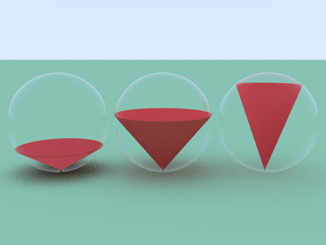

# C++ Ray Tracer

This is a path tracer I wrote following the
[Ray Tracing in One Weekend](https://raytracing.github.io/books/RayTracingInOneWeekend.html)
book.

### Supported Features:

- Diffuse, Metallic, & Dielectric Materials
- Spheres, Planes, Cones
- Unions & Intersections
- Depth of Field
- Parallelism with OpenMP

### Usage Guide:

To run this code yourself, clone the repository, and open the CMake project (CMakeLists.txt) in your favorite C++ IDE. I used CLion.

This project is for learning, so scene generation is written with code.
See `main.cpp` for the code that generated these scenes below:

### Select Renders:

